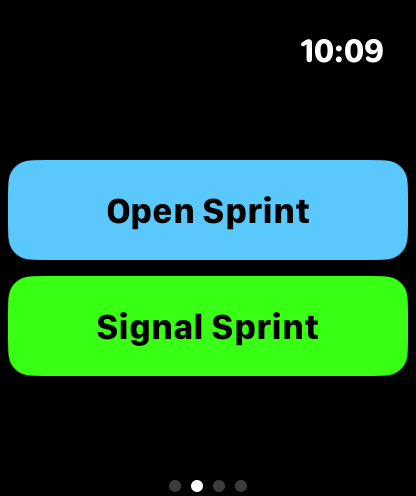
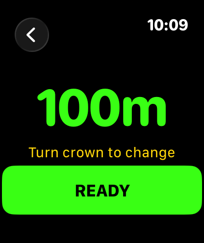
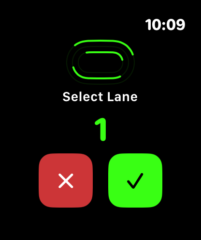
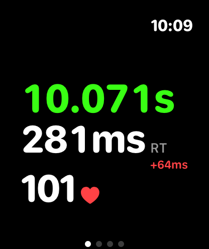
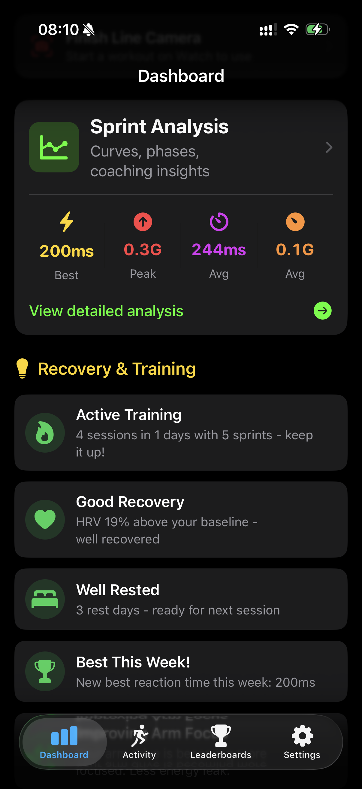
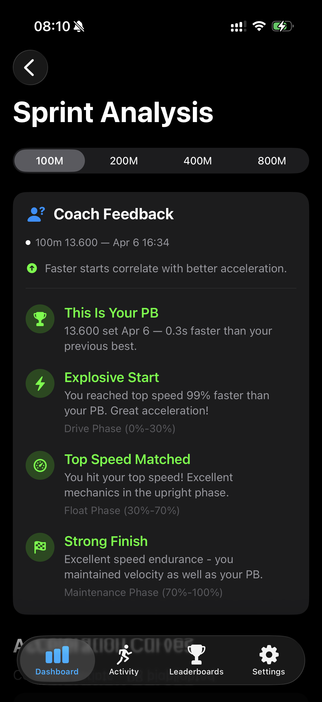
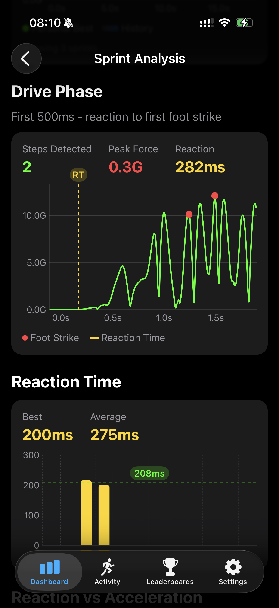
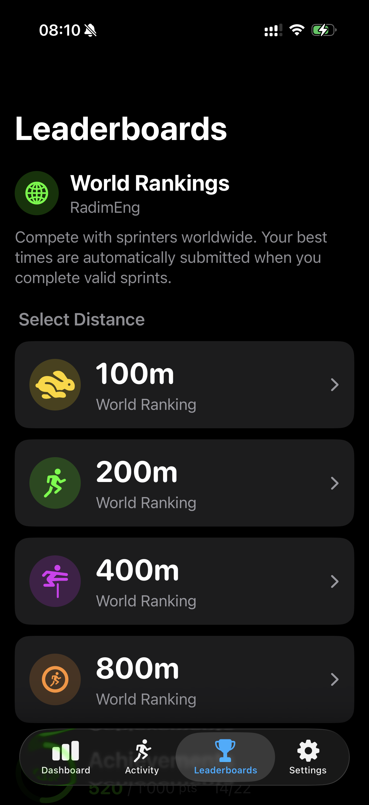
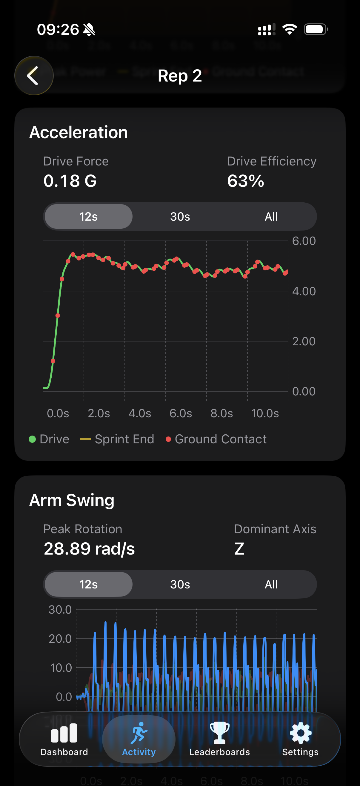
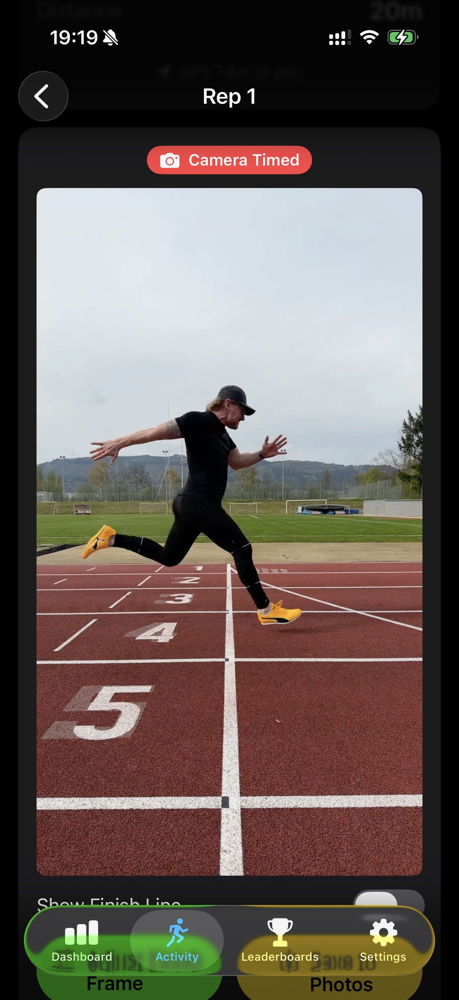

# Falcata Run

**The gold standard for sprint tracking.** A watchOS-first sprint training app for 100m, 200m, 400m, and 800m runners — built for sprinters, coaches, and track clubs who care about milliseconds.

🌐 [falcatarun.com](https://falcatarun.com)

---

## What it is

Falcata Run turns your Apple Watch into a starter pistol and sprint sensor, with optional iPhone camera tools for finish-line validation and full-sprint video overlays — and a native **Mac app, Falcata Analyzer**, for deep desktop review and video editing. There's also a free **web analyzer** at [app.falcatarun.com](https://app.falcatarun.com) for marking distance splits and ground contact time on any sprint video, right in your browser — no install and no Apple hardware required.

It captures motion at 100 Hz during every sprint and surfaces the metrics that actually matter: **reaction time, drive force, cadence, stride length, arm drive efficiency, and time to max speed.** Then it tells you what to fix, what to keep, and how to get faster.

**10× more accurate than standard running apps.** Generic fitness trackers are built for 5Ks and marathons. Falcata Run is built for the 10-second window where races are won.

## Who it's for

- **Sprinters** training the 100, 200, 400, and 800
- **Coaches** who need objective data on reaction time, form breakdown, and fatigue patterns
- **Masters athletes** chasing PBs into their 40s, 50s, 60s and beyond
- **Teams** running block starts at practice and simulating meet conditions

## What it measures

- ⚡ **Reaction time** — millisecond-accurate block start detection
- 🚀 **Drive force** — propulsive G-force through the acceleration phase
- 👟 **Cadence & stride** — step frequency (Hz) and stride length from gyroscope-verified step detection
- 💪 **Arm drive & ROM decay** — how much your form fades under fatigue
- 🏁 **Sprint end detection** — piecewise linear fit finds the true finish, not just when you stopped
- 📸 **Camera finish** — optional iPhone finish-line photo with data overlay
- 🎥 **Start Line Camera** — record starts or full sprints on iPhone and export telemetry video overlays
- 🏃 **Effort %** — how hard you ran vs your PB at the same distance
- 🔄 **Curve compensation** — corrects for centripetal force and body lean on 200m+ bends
- 📊 **Deep Sprint Analysis** — acceleration curve overlays, drive phase zoom, RT-vs-acceleration correlation

## See it in action

### On the Watch — track-side

| | | | |
|---|---|---|---|
|  |  |  |  |
| **Open or Signal Sprint** — free run or meet-simulation block start | **Distance select** — 100m, 200m, 400m, 800m, and more via crown | **Lane select** — for curve-accurate 200m and 400m distance | **Instant result** — finish time, reaction time, delta from PB, heart rate |

### On the iPhone — analyst view

| | |
|---|---|
|  |  |
| **Dashboard** — Sprint Analysis summary, recovery status, training load | **Coach feedback** — phase-by-phase insights and PB detection |
|  |  |
| **Deep Sprint Analysis** — drive phase zoom, foot strike detection, reaction time trend | **World leaderboards** — 100m, 200m, 400m, and 800m global rankings |
|  |  |
| **Rep detail** — acceleration, drive force, efficiency, arm swing analysis | **Camera finish** — validated sprint times with automatic data overlay |

### On the Mac — Falcata Analyzer

A native macOS app that opens your exported sprint sessions and reuses the exact same engine as the Watch and iPhone — so the charts on your Mac show the same math your wrist captured, with no separate desktop calculation path.

| | |
|---|---|
|  |  |
| **Charts review** — synchronized velocity, drive, power, acceleration, arm swing, and GCT charts on one shared, scrubbable playhead | **Video workspace** — link your own sprint footage, align it to the telemetry, trim it, and burn a configurable telemetry overlay into an exported clip |

What Falcata Analyzer adds on the desktop:

- **Open exported sprint sessions** and browse every sprint with its stored metrics and canonical charts.
- **Synchronized chart analysis** — one shared playhead and time-range selection across all lanes, maximize a single lane, and open charts in separate resizable windows side by side.
- **Video editing workspace** — link an external sprint video, align it to the acceleration onset, trim it, scrub frame-accurately, and edit Start / Finish / Distance markers on the video timeline or the charts.
- **Telemetry video overlay + export** — choose which telemetry lanes appear over the footage and export a trimmed clip (H.264 MP4 / QuickTime, with resolution, frame-rate, and bitrate control).
- **Chart and CSV export** — export stacked charts as PNG / JPEG (dark or white background, optional sprint info) or export the underlying lanes and markers as CSV.
- **Standalone video analysis** — open any video without a linked sprint and mark Start / Finish / Distance points to measure velocity and acceleration straight from the footage (the same marker-based workflow as the web analyzer).
- **Team Roster** — organize athletes and assign their sessions and videos, so a coach can manage a whole squad from one library.
- **AI Sprint Coach (optional)** — coaching grounded in your measured numbers, plus a chat that answers across your whole imported history. Run it on device with Apple Intelligence or a local open model, or bring your own cloud API key (Anthropic, OpenAI, OpenRouter); on-device providers keep your data on your Mac.

### In the browser — Falcata Web Analyzer

A free, install-free web app at **[app.falcatarun.com](https://app.falcatarun.com)** that runs entirely in your browser. It's the marker-based side of Falcata — for any sprint video, from any phone or camera, with no Apple Watch required.

- **Open a local video** and scrub it frame by frame.
- **Place distance markers** (Start / Distance / Finish) and **ground contact time (GCT)** spans on the timeline.
- **Read velocity, acceleration, and sprint stats** (duration, max average speed, start acceleration) computed from your markers and validated against the Start–Finish window.
- **Export** a WYSIWYG PNG, a short sprint video clip (WebM / MP4, with audio), or a CSV of your markers and segments.
- **Metric or imperial** units, with per-video markers auto-saved in your browser.
- **Private by design** — your video is processed locally and never uploaded; only your markers are stored, on your device.

It complements Falcata Analyzer on the Mac: the Mac app overlays your Watch telemetry on your footage, while the web analyzer needs only the video and your markers.

## New and upcoming

Recently added:

- **Falcata Web Analyzer** — a free, no-install browser app at [app.falcatarun.com](https://app.falcatarun.com) for marking distance splits and ground contact time on any sprint video, with PNG / short-video / CSV export.
- **AI Sprint Coach in Falcata Analyzer** — on-device (Apple Intelligence or a local model) or bring-your-own-key cloud (Anthropic, OpenAI, OpenRouter) coaching, with a chat that reads across your whole imported sprint history.
- **Falcata Analyzer for macOS** — a native desktop app for reviewing exported sprints, side-by-side chart windows, video editing with telemetry overlays, and chart / video / CSV export.
- **Start Line Camera modes** — choose a short slo-mo start capture or record the full sprint.
- **Full Sprint video overlay export** — creates a normal-speed video with timer, reaction time, velocity/drive chart, foot-strike ticks, and GCT bars.
- **Shared signal processors** — video overlays and the Mac app use the same sprint metrics, step detection, GCT, and velocity profile as the app charts.
- **Bounded export duration** — full-sprint video exports are capped at 20 seconds to keep processing practical.

Roadmap focus:

- Make the Start Line Camera workflow clearer and easier to use.
- Improve video overlay validation against real sprint footage.
- Keep refining sprint timing, acceleration, step detection, and camera matching from measured data.
- **AI coaching is not planned at this time.** The current focus is reliable biomechanics, honest metrics, and camera-backed evidence.

## Why Apple Watch-first

Sprinters are on the track. Phones are in bags. Falcata Run runs fully offline on the Watch — recording, real-time metrics, start sequences, even meet-simulation tone patterns. Your iPhone is the analyst view: charts, history, sharing, deep analysis.

## Platforms

- Apple Watch (Series 6 and later recommended for full running-dynamics support)
- iPhone (iOS analyst companion)
- Mac (Falcata Analyzer, macOS 15 or later — desktop review, video editing, and export)
- Web (Falcata Web Analyzer — any modern browser at [app.falcatarun.com](https://app.falcatarun.com), no install, no account)
- iCloud Drive for session backup
- HealthKit integration (workouts, heart rate, HRV, running dynamics)

## Links

- 🌐 Website: [falcatarun.com](https://falcatarun.com)
- 🖥️ Web analyzer: [app.falcatarun.com](https://app.falcatarun.com)
- 📖 [About Falcata Run](./ABOUT.md)
- ✨ [Full feature list](./FEATURES.md)
- ❓ [FAQ](./FAQ.md)

---

*Falcata Run is built by [Radim Simanek](https://github.com/Rad1m) and is a trademark of its respective owner. This repository contains marketing and documentation content only — the app's source code is private. See [LICENSE](./LICENSE) for usage terms on the documentation content.*
